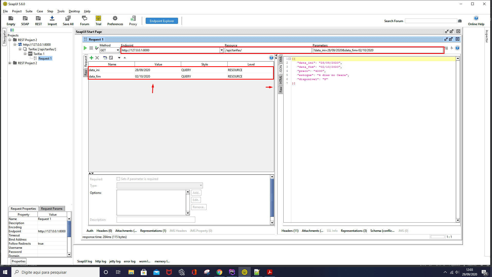
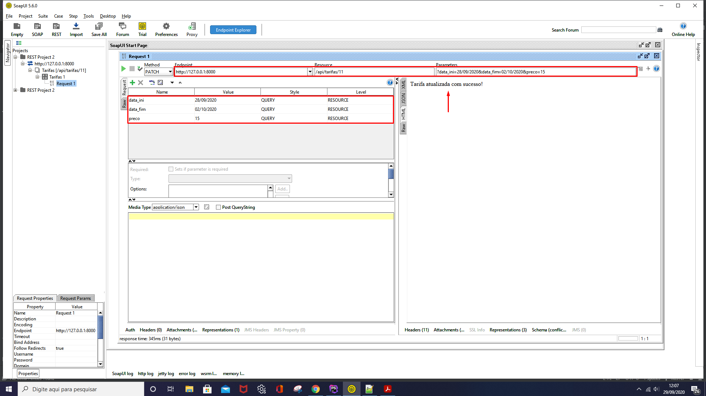
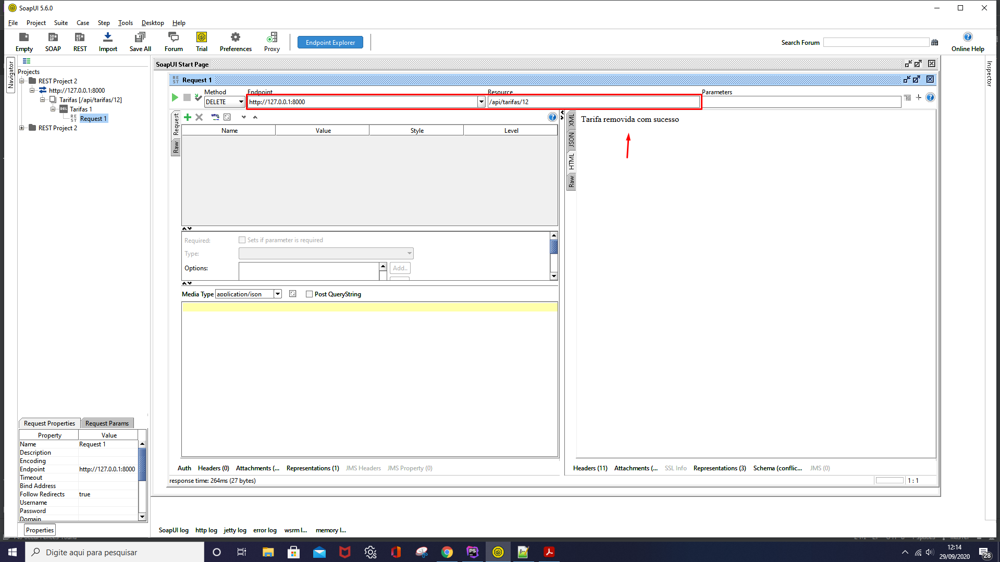

## Configuração de instalação Zarpo

API simples de gestão de tarifas de um hotel fictício.

- [Instalação da Aplicação - clone](https://github.com/eduardo1520/zarpo.git).
    - Com o [Git](https://git-scm.com/downloads) instalado corretamente em sua máquina, faça o clone da aplicação no link acima.
    - Instale as dependências do projeto rodando o comando no terminal [Node](https://nodejs.org/en/) npm install
    - É preciso ter o [PHP](https://www.apachefriends.org/pt_br/index.html) instalado na máquina que vai rodar a aplicação
    - Subir a aplicação rode o comando no terminal php artisan serve
    
- Banco de dados utilizado SQLite.
    - [Soupui](https://www.soapui.org/downloads/download-soapui-pro-trial/) - programa utilizado para testar as requisições da API.

## Requisito da Aplicação

- [Manual Técnico](zarpo/Teste para Desenvolvedor PHP.pdf)

- Tela de Login da aplicação
    

- Tela princial da aplicação
    

- Tela de listagem de Tarifas - URL

- Tela de listagem com intervalo de datas - URL

- Soapui - Lista de Tarifas

- Soapui - Cadastro de Tarifas

- Soapui - Pesquisa de Tarifas por Código

- Soapui - Pesquisa de Tarifas por intervalo de data

- Soapui - Atualização da Tarifa

- Soapui - Remover uma Tarifa

## License

The Laravel framework is open-sourced software licensed under the [MIT license](https://opensource.org/licenses/MIT).
